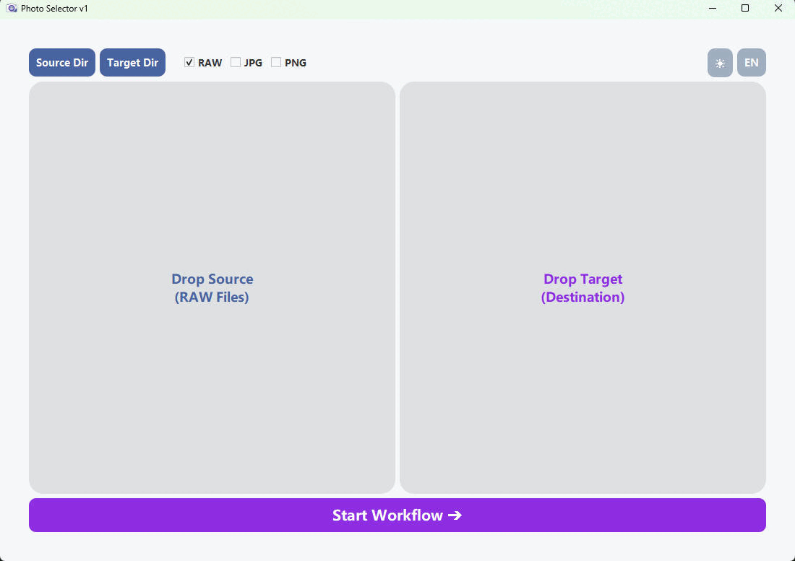

# Photo Selector 📸

[English](#english) | [简体中文](#chinese)

---

## English
**Photo Selector** is a high-performance, lightweight alternative to Adobe Bridge, specifically designed for photographers who need to cull massive amounts of RAW files at lightning speed.

### ✨ Key Features
* **Zero-Lag Preview**: Instant rendering of RAW files (.ARW, .CR3, .NEF, .DNG). Meanwhile the filter function is also available for JPG and PNG.
* **Speed Culling**: 
  * `Space`: Move to target folder instantly.
  * `Enter`: Mark/Check for batch processing.
* **Smart Memory**: Remembers your paths, theme (Dark/Light), and language preferences.
* **Cross-Platform**: Built with Python & PyQt5 (Supports Windows & macOS).

### Extra info
For macOS users, please follow these steps to build the native app:
Download pro_selector_v6.py and icon.ico.
Install dependencies:
`pip install PyQt5 rawpy pyinstaller`
(Optional) Convert your icon to .icns format for a better look.

Build the application:
`pyinstaller --noconsole --onefile main.py`
Find your executable .app bundle in the /dist directory.

---

## 简体中文
**Photo Selector** 是一款高性能、轻量化的 Adobe Bridge 替代方案。专为需要极速筛选海量 RAW 照片的摄影师打造。

### ✨ 核心功能
* **零延迟预览**：即时读取并显示 .ARW, .CR3, .NEF, .DNG 等主流 RAW 格式。JPG和PNG格式也支持，需要在过滤器中勾选。
* **极速选片工作流**：
  * `空格键`：瞬间将照片移动至目标文件夹。
  * `回车键`：标记照片，以便稍后批量处理。
* **智能记忆**：自动保存您的路径设置、日夜主题切换以及语言偏好。
* 基于 Python 与 PyQt5 开发（支持 Windows 与 macOS）。

### 额外贴士：如果你是MacOS用户：
macOS 用户请参考以下步骤构建原生应用：
下载 pro_selector_v6.py 和 icon.ico。
安装必要环境：
`pip install PyQt5 rawpy pyinstaller`
（可选）为了图标美观，建议将 .ico 转换为 macOS 专用的 .icns 格式。
执行打包命令：
`pyinstaller --noconsole --onefile main.py`
打包完成后，可在 /dist 文件夹中找到生成的 .app 程序。

